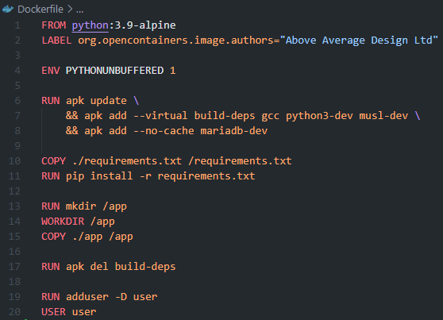
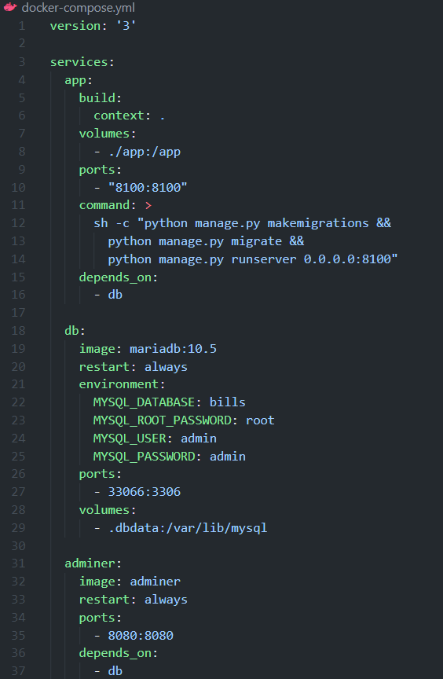

# Django & MariaDB biilling Tracker Using Docker

## Requirements

1. Docker.
    - For help installing Docker to your machine, refer to the [documentation](https://docs.docker.com/get-docker/)
2. General knowledge of [Python](https://www.python.org/doc/) and [Django](https://docs.djangoproject.com/en/3.2/)
3. General knowledge of [MariaDB](https://mariadb.org/documentation/)

## Setup Guide

_**Note:** if you want to just use the base files, just run the script below in your terminal, in the same directory as your [docker-compose.yml](docker-compose.yml)_

    docker-compose up -d --force-recreate

### Setting up Dockerfile and Docker-Compose

First, you will need to set up your _Dockerfile_ as this will be used to create your container.

In our example, we are using _Alpine_ which is a lightweight linux distribution to install python. In order to prepare our distribution for MariaDB, we must first install a few dependancies as shown in the first _RUN_ command.

Then we copy the _requirements.txt_ file from the host machine to the container with our python requirements. Then we run a _pip install_. Next we create a new directory call _app_ which will hold our django project. We make it our working directory.

#### Docker-Compose

Now we move to our _docker-compose.yml_ file (shown below). We first specify the version of _docker-compose_ we want to use. Then we create our _services_ that we want to run.

- _app_ is our Django project.
  - We make sure to include the *depends_on* the _db_ (MariaDB) so that Django will not start/run unsless our MariaDB service is running.
- _db_ is our MariaDB database.
  - We must make sure to include the database we will use along with username & passwords. To ensure that we are able to locate the database files on our host machine, we include the _volumes_ to map from the container to a folder on our host machine called _.dbdata_
- _adminer_ This service is not neccessary but will allow the user to view their database through a web browser.
  - You can access the database through your own client. If so, feel free to remove _adminer_ from the file.

#### Building the container

Once you have completed the above run the following in your terminal, making sure to be in the same directory as your _Dockerfile_ and _docker-compose.yml_ file.

    docker-compose build
    docker-compose up

The first command may take a few momemnts to build the container. You should see directories being added to your host machine as this is processed.

----------------------------------------------

### Getting Django Setup

Before continuing you will need to run the _sql_ script _add_admin.sql_ in the terminal of your mariadb service. To access this from the terminal run the below.

    docker-compose exec db sh
    mysql -u root -p

The first command moves you to your database service, and the second signs you into the mariaDB terminal client.

You will be prompted to sign in using the _**root**_ password which was defined in the _docker-compose.yml_ file from earlier.

Once signed into your database service run the folliwing:

    /* This allows us to access the database externally */

    CREATE USER 'admin'@'localhost' IDENTIFIED BY 'admin';

    GRANT ALL PRIVILEGES ON *.* TO 'admin'@'localhost' WITH GRANT OPTION;

    FLUSH PRIVILEGES;

Now we are ready to create our Django app. To do this run the following

    docker-compose exec app sh -c "django-admin startproject app"

Make sure to change _app_ to whatever you want your project to be called. After a few moments, your django project will be created

Now that your project has been created, you will need to add your database links to your project in the _settings.py_ file located in your project folder (if you have been following along, the folder is called _app_).

That will allow us to connect to our database from the django app. Now we want to create our first application. Back in our terminal we will run the following:

    docker-compose exec app sh -c "django-admin startapp bills"

After this has run, we will now have to add our app to the _settings.py_ file:

## Creating a superuser

To ensure a user is able to access the admin website (and thus create other users with varying privileges).

For this example, I used the following:

- Username: admin1
- Email address: admin1@example.com
- Password: amdin1
  - **Note:** I received the error in red because the entered password was exactly the same as the username, for production enviornments, a stronger password is reccommended.

If your information was entered correctly you will receive the message: _**Superuser created successfully**_.

## Adding Models To Our Project

We add _models_ to our project similar to any other Django project. For this project, refer to the _[models.py](/app/bills/models.py)_ file. Then we will make migrations and then migrate to our database

    docker-compose exec app sh -c "python manage.py makemigrations"
    docker-compose exec app sh -c "python manage.py migrate"

Once the above has completed, we will now be ready to run our container.

    docker-compose up

Now on your local machine, you will be able to navigate to your website at the following: _**localhost:8000**_, or whatever port you used in your _[docker-compose.yml](docker-compose.yml)_ file.

## Connecting to MariaDB

If you would prefer not to use adminer as your method of working with the database you will need the IP and Port:

- IP: 12.0.0.1
- Port: 33066
- Database: bills

From this connection you will be able to run other SQL scripts.

## Current Development

----------------------------------------------

For current development, we want to accomplish the below

1. Adding a monthly breakdown section with plots _(completed [09/29/2021])_
2. Adding a form for entering new data
3. Adding a user sign-in page to enter and use the site.

----------------------------------------------

### Monthly Breakdown

We want to access the shell of our project in order to work to determine to work with our project in an interactive enviornment use the below

    python manage.py shell

You will be greeted with the below

From there, we will work with our _bills_ app, to determine what the best way to implement a monthly breakdown.

    # Import our models from the bills app
    from bills.models import BillPaid, Bill
    
    # Import Trunc month to so that we can truncate months to just the month & year
    from django.db.models.functions import TruncMonth

    # We want to import a few functions like Sum, Avg and Count
    from django.db.models import Sum, Count, Avg

    # Setting up the monthly breakdown
    mb = BillPaid.objects.annotate(month=TruncMonth('paidDate')).values('month').annotate(sums=Sum('totalPaid')).values('month','sums').order_by('month')

The above gives us the setup we need to make a view. Going back to the shell, if we show the results from _'mb'_ we can see the below:

As we can see, there are some results, where we have the output in the format of _'YYYY'_, *'M'*, _'D'_. When we add our view to the html template, we can format it so that we can only show the month and year.

Now if we hop into our [views.py](/app/bills/views.py) file in our bills app, we can add our file as below.

Now we are ready to create our html template for the monthly breakdown. For ease, refer to the [bills-mb.html](/app/bills/templates/pages/bills.html) for the full file outline. Also, make sure to update the [urls.py](/app/bills/urls.py) file so that we can access the view from our django site. If all were updated properly, you should be able to see the breakdown page similar to the below.

**_Note:_** Your view may differ based on your entered data. As we can see from the table, there are only two entries.

----------------------------------------------

### Adding Forms

To add a form that uses the input of our models, we can create a new file in our app called [forms.py](/app/bills/forms.py). In this file we can specify which model we want to use. In our case, we want to be able to add _**new**_ bills, carriers, and products.

We specify that we want to add all fields into our form.

Note that for all fields in the model that have _**editable=False**, the field will not appear on our form.

In our case, the [views.py](/app/bills/views.py) file will look like the below (make sure to import the form into your views file or else you will get an error when running the app).

