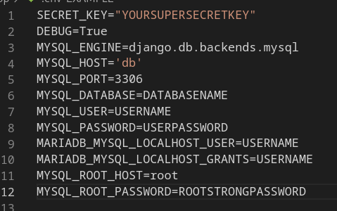
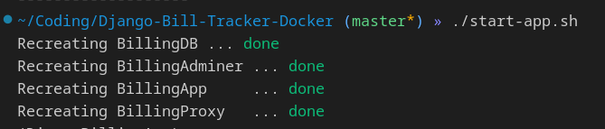

# Django MariaDB Nginx Stack

## Purpose

This container project allows us to create a stack which utilizes Django, MariaDB, and Nginx. The Django app allows the user(s) to keep track of their monthly billing expenses, by providing a convienient form for adding new bills and updating them when they have been paid.

I currently use this container stack to keep track of my household's current monthly bills to verify that they have been paid and average total monthly bill amounts.

## Getting started

If you have cloned this repository, you will need to update the enviornment variables for your Django and MariaDB Apps. To do so, rename the [.env-EXAMPLE](app/.env-EXAMPLE) to just .env. Then update the parameters as this will allow your Django app to communicate with the MariaDB database and other features. It should look something like the below:



Please note, that the key items to change are:

- **MYSQL_DATABASE**: This will be the name of your billing app. If you are not modifying anything - then set this value to _bills_.
- **MYSQL_USERNAME**: Set as anything you want
- **MYSQL_PASSWORD**: Set as anything that you want but please note that in order to to maintain security, you will want to ensure that you have a strong password.

Once you have updated your enviornment file, run the [shell script](./start-app.sh) in the root directory of the cloned repository. If you are on a windows machine, please use [WSL].

```sh:
./start-app.sh
```

You should see something like the below:



If you see any errors, you may need to reconfigure the [start-app.sh](./start-app.sh) to show more output in your terminal.

Once your docker-compose runs without error, you should be able to navigate to the Django app via the host machine's IP address.

If you would like to access the admin page, in your browser go to the homepage of the app with \admin. Example: "0.0.0.0:8001/admin". You should be greeted with a login page, where you will enter the username and password from before.

## Resources

1. [Docker]: For help installing Docker to your machine,
2. General knowledge of [Python]
3. [Django] documentation
4. General knowledge of [MariaDB]
5. [Nginx] for resources and documentation on what Nginx is, and how to use it.


<!-- Resource links -->
[Docker]: https://docs.docker.com/get-docker/
[Python]: https://www.python.org/doc/
[Django]: https://docs.djangoproject.com/en/3.2/
[MariaDB]: https://mariadb.org/documentation/
[Nginx]: https://nginx.org/
[WSL]: https://learn.microsoft.com/en-us/windows/wsl/install